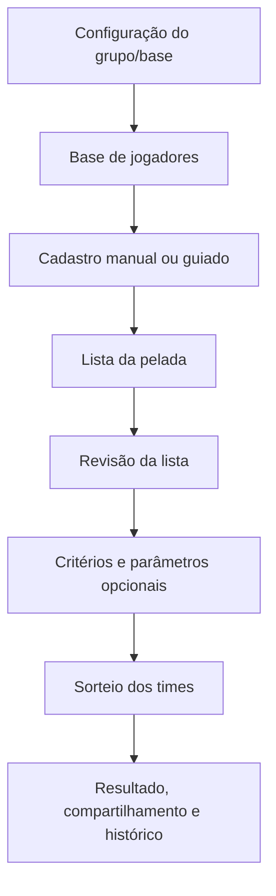
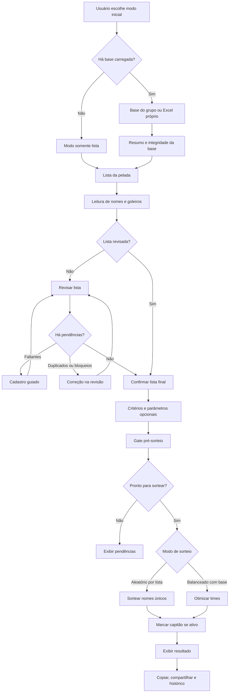

# Contrato Operacional do App — Sorteador Pelada PRO

**Status:** documento mestre operacional  
**Microetapa:** v136-docs-contrato-operacional-app  
**Baseline funcional documentada:** `main` após incorporação da v135  
**Commit base auditado:** `13c184d09b14f6ca8861b6568699eef8f68abaad`  
**Última baseline funcional confirmada manualmente:** v134  
**Hotfix funcional incorporado antes desta documentação:** v135 — PR #13 mergeado  
**Natureza da microetapa:** documental, sem reimplementação funcional

Este contrato descreve o comportamento vigente do aplicativo Sorteador Pelada PRO após a incorporação da v135. O documento não define intenção futura nem autoriza alteração funcional. Qualquer divergência entre este documento e o código vigente deve ser tratada como pendência de auditoria antes de nova promoção de baseline.

---

## 1. Finalidade do app

O Sorteador Pelada PRO organiza uma lista de jogadores e sorteia times para uma pelada, com dois modos operacionais principais:

1. **Sorteio aleatório por lista**, quando não há base carregada.
2. **Sorteio balanceado com base**, quando há base de jogadores carregada ou construída manualmente.

No modo balanceado, o app utiliza atributos dos jogadores para tentar equilibrar os times por critérios opcionais. No modo aleatório, o app usa apenas os nomes únicos lidos da lista, sem métricas e sem cálculo de odds.

---

## 2. Escopo funcional

O app cobre, no comportamento vigente:

- configuração inicial do fluxo;
- carregamento de base do grupo;
- carregamento de Excel próprio;
- uso sem base, apenas com lista;
- cadastro manual de jogadores;
- revisão da lista;
- correção de duplicidades e inconsistências;
- cadastro guiado de nomes faltantes;
- leitura opcional da seção `Goleiros:`;
- ativação opcional de goleiros quando a quantidade detectada é compatível com o número de times;
- seleção de critérios de equilíbrio;
- sorteio balanceado com base;
- sorteio aleatório por lista;
- sorteio opcional de capitão;
- exibição dos times;
- geração de texto para copiar ou compartilhar;
- histórico curto de resultados da sessão.

---

## 3. Escopo não funcional

Este contrato também fixa regras de manutenção:

- a frente documental não deve alterar regras de sorteio;
- a frente documental não deve alterar o otimizador;
- a frente documental não deve reabrir cadastro guiado, revisão, scrollfix ou componentes visuais de resultado;
- arquivos sob escopo protegido só podem ser alterados com justificativa formal e atualização do manifesto de hashes;
- toda alteração versionada deve passar por branch própria, PR, auditoria preventiva, validação e auditoria pós-implementação.

---

## 4. Visão geral do fluxo

O fluxo operacional é progressivo, mas algumas etapas aparecem apenas quando o contexto exige. Por exemplo, a etapa de base aparece quando há base carregada; a etapa de cadastro manual pode ficar oculta até ser necessária; a revisão é liberada depois que há lista lida; critérios e sorteio aparecem depois da confirmação da lista.



### 4.1 Observação sobre numeração visual

A numeração exibida na interface pode variar conforme o modo de uso. Quando não há base carregada, o app pode ocultar ou renumerar etapas. O contrato funcional, porém, preserva as oito etapas lógicas acima como referência operacional.

---

## 5. Fontes de código auditadas para este contrato

A v136 documenta o comportamento confirmado por inspeção dos seguintes arquivos:

- `app.py`;
- `core/logic.py`;
- `core/flow_guard.py`;
- `core/optimizer.py`;
- `core/validators.py` quando citado indiretamente por funções de validação;
- `state/keys.py`;
- `state/session.py`;
- `state/criteria_state.py`;
- `state/ui_state.py` quando citado indiretamente pelo fluxo visual;
- `state/view_models.py` quando citado indiretamente pelo fluxo visual;
- `ui/group_config_view.py`;
- `ui/base_view.py`;
- `ui/manual_card.py`;
- `ui/review_view.py`;
- `ui/result_view.py`;
- `ui/summary_strings.py`;
- `ui/pre_sort_view.py`;
- `scripts/quality/protected_scope_hash_guard.py`;
- `scripts/quality/release_artifacts_hygiene_guard.py`;
- `scripts/quality/script_exit_codes_contract_guard.py`.

Se qualquer função ou estado citado deixar de existir, o documento deve ser revisado antes de ser usado como referência normativa.

---

## 6. Estados principais da sessão

Os estados de sessão são centralizados em `state/keys.py`. A tabela abaixo resume os estados mais relevantes para o contrato mestre.

| Grupo | Chaves principais | Uso operacional |
|---|---|---|
| Base | `df_base`, `novos_jogadores`, `is_admin`, `base_admin_carregada`, `ultimo_arquivo` | Controlam base ativa, origem e complementos manuais. |
| Configuração do grupo | `grupo_origem_fluxo`, `grupo_busca_status`, `grupo_nome_pelada`, `grupo_senha_admin`, `senha_admin_confirmada` | Controlam escolha entre lista, base do grupo e Excel próprio. |
| Lista | `lista_texto_input`, `lista_texto_input__draft`, `lista_texto_input__pending`, `lista_texto_revisado` | Guardam texto colado, rascunho e versão revisada. |
| Revisão | `diagnostico_lista`, `lista_revisada`, `lista_revisada_confirmada`, `revisao_lista_expandida` | Controlam diagnóstico, lista final e confirmação. |
| Cadastro guiado | `faltantes_revisao`, `cadastro_guiado_ativo`, `faltantes_cadastrados_na_rodada`, `revisao_pendente_pos_cadastro` | Controlam fila e estado de cadastro de faltantes. |
| Critérios | `criterio_posicao`, `criterio_nota`, `criterio_velocidade`, `criterio_movimentacao` | Definem critérios usados no sorteio balanceado. |
| Parâmetros opcionais | `sortear_goleiros`, `sortear_capitao`, `qtd_times_sorteio` | Controlam goleiros, capitão e quantidade de times. |
| Resultado | `resultado`, `resultado_contexto`, `resultado_assinatura`, `resultado_invalidado_msg` | Guardam resultado vigente e sua assinatura de validade. |
| Histórico | `resultados_sessao_historico`, `resultado_historico_ativo_id`, `resultado_historico_ultimo_snapshot_id` | Guardam snapshots de sorteios da sessão. |
| Scroll/UX | `scroll_para_lista`, `scroll_para_revisao`, `scroll_destino_revisao`, `scroll_alvo_id_revisao`, `scroll_para_sorteio`, `scroll_para_resultado` | Controlam navegação visual entre blocos. |

---

## 7. Entradas globais

As entradas globais reconhecidas pelo contrato são:

1. **Modo inicial de uso**:
   - apenas sorteio com lista;
   - carregar base do grupo;
   - usar Excel próprio.
2. **Credenciais do grupo**, quando aplicável:
   - nome da pelada;
   - senha administrativa.
3. **Arquivo Excel próprio**, quando aplicável.
4. **Lista da pelada**, numerada ou não.
5. **Seção opcional `Goleiros:`**, dentro da lista.
6. **Número de times**.
7. **Dados manuais de jogador**:
   - nome;
   - posição;
   - nota;
   - velocidade;
   - movimentação.
8. **Critérios de equilíbrio**:
   - posição;
   - nota;
   - velocidade;
   - movimentação.
9. **Parâmetros opcionais**:
   - incluir goleiros no sorteio;
   - sortear capitão.

---

## 8. Saídas globais

As saídas globais do app são:

- mensagens de status da sessão;
- alertas de integridade da base;
- resumo da base;
- diagnóstico da lista;
- lista final sugerida;
- bloqueios e pendências de revisão;
- confirmação da lista final;
- resumo pré-sorteio;
- times sorteados;
- odds, quando o sorteio usa base e métricas;
- marcação textual de capitão com `(C)`, quando ativado;
- texto de compartilhamento;
- snapshots de histórico da sessão.

---

## 9. Regras contratuais do sorteio

### 9.1 Sorteio aleatório por lista

O modo aleatório ocorre quando não há base pronta e há nomes únicos suficientes na lista. Nesse modo:

- o app usa nomes únicos extraídos da lista;
- duplicidades são tratadas como alerta de revisão;
- critérios de equilíbrio são ignorados;
- odds não são aplicadas;
- cada jogador é alocado em rodízio após embaralhamento;
- o capitão pode ser marcado depois da montagem dos times, se o parâmetro estiver ativo.

### 9.2 Sorteio balanceado com base

O modo balanceado ocorre quando existe base carregada ou construída. Nesse modo:

- a lista precisa ser revisada;
- a lista final precisa ser confirmada;
- a base não pode ter bloqueios relevantes para os nomes do sorteio;
- o cadastro guiado não pode estar ativo;
- os critérios ativos são obtidos de `obter_criterios_ativos()`;
- a montagem dos times é delegada a `logic.otimizar()`, que chama `core.optimizer.otimizar()`;
- o capitão é aplicado depois da otimização, em `marcar_capitaes_times()`.

### 9.3 Critérios de equilíbrio

Os critérios disponíveis são:

- posição;
- nota;
- velocidade;
- movimentação.

Por padrão, os quatro critérios são considerados ativos. Quando todos estão ativos, o perfil visual é tratado como padrão. Quando nenhum ou apenas parte deles está ativa, o perfil visual é tratado como personalizado.

---

## 10. Regras contratuais de goleiros

As regras vigentes para goleiros são:

1. A lista pode conter uma seção textual `Goleiros:`.
2. Os nomes dessa seção são lidos separadamente por `logic.processar_lista()`.
3. A opção **Incluir goleiros no sorteio** fica visível junto da lista e do número de times.
4. A opção fica operacional apenas quando `qtd_goleiros_lidos == n_times` e há pelo menos um goleiro detectado.
5. Quando a quantidade de goleiros é incompatível com o número de times, a opção permanece visível, mas desabilitada, e `sortear_goleiros` é forçado para `False`.
6. Quando ativados, os goleiros entram na revisão e podem precisar de cadastro ou correção.
7. A posição `G` é aceita no fluxo guiado de revisão/cadastro de faltantes.
8. No sorteio balanceado, se a quantidade de jogadores com posição `G` no otimizador for exatamente igual ao número de times, o modelo impõe exatamente um goleiro por time.
9. A restrição de goleiros é mais forte que a distribuição comum por posição: posições `D`, `M` e `A` participam do equilíbrio posicional; goleiros, quando compatíveis, têm restrição específica de um por time.

---

## 11. Regras contratuais de capitão

As regras vigentes para capitão são:

1. O capitão é parâmetro opcional pós-confirmação da lista.
2. A opção **Sortear Capitão** aparece entre o painel de próximos passos e o botão **SORTEAR TIMES**.
3. O capitão é sorteado após a montagem dos times.
4. A marcação é textual: `(C)`.
5. O capitão não altera a otimização dos times.
6. Em cada time não vazio, quando o parâmetro está ativo, um jogador é marcado como capitão.
7. O texto de cópia/compartilhamento usa a mesma marcação textual `(C)`.
8. O painel de detalhes do sorteio deve exibir `Capitão: Ativo` quando o resultado contém capitão sorteado, inclusive quando o contexto `resultado_contexto["sortear_capitao"]` não estiver preenchido.

### 11.1 Observação de auditoria pós-merge da v135

Após o merge da v135, houve comentário automatizado apontando risco residual no cenário de visualização de sorteio histórico: o painel de detalhes pode consultar `st.session_state["resultado"]` como fallback quando exibe um snapshot anterior. Esta microetapa v136 não altera código funcional; a observação fica registrada como risco a avaliar em microetapa própria, caso seja priorizada.

---

## 12. Regras contratuais de revisão e cadastro guiado

A revisão da lista é obrigatória no fluxo balanceado e pode atuar no modo aleatório para tratar nomes únicos e duplicados.

A revisão pode detectar:

- linhas ignoradas;
- correções automáticas por correspondência com a base;
- duplicidades na lista;
- nomes não encontrados na base;
- registros bloqueados por duplicidade ou inconsistência na base.

O cadastro guiado é ativado quando há faltantes na revisão balanceada. O fluxo guiado:

- mantém fila de faltantes em `faltantes_revisao`;
- ativa `cadastro_guiado_ativo` enquanto houver pendências;
- permite informar nome, posição, nota, velocidade e movimentação;
- usa posição `G` como padrão quando o nome faltante veio da seção de goleiros;
- atualiza a base corrente;
- força nova revisão antes de liberar confirmação final;
- não libera sorteio enquanto houver cadastro guiado ativo.

---

## 13. Regras contratuais de invalidação de resultado

O resultado sorteado é protegido por assinatura de entrada, construída a partir de:

- texto da lista;
- número de times;
- critérios ativos;
- parâmetros opcionais de sorteio;
- base ativa;
- jogadores adicionados manualmente.

Quando a assinatura atual difere da assinatura armazenada em `resultado_assinatura`, o app remove o resultado vigente, limpa o contexto de resultado e exibe mensagem informando que o resultado anterior foi invalidado porque os dados de entrada mudaram.

Mudanças em parâmetros pré-revisão, especialmente `sortear_goleiros`, também podem invalidar revisão e resultado, exigindo nova revisão antes de sortear.

---

## 14. Regras de proteção de arquivos

São considerados sensíveis neste ciclo:

- `app.py`;
- `core/optimizer.py`;
- `ui/review_view.py`;
- `docs/releases/PROTECTED_SCOPE_HASHES.json`.

`app.py` e `ui/review_view.py` estão sob escopo protegido por manifesto de hash. Alterações nesses arquivos exigem justificativa formal, atualização do manifesto e execução de `python scripts/quality/protected_scope_hash_guard.py`.

A frente documental v136 não altera código, testes nem manifesto protegido.

---

## 15. Scripts de validação

Os comandos de validação relevantes para esta frente são:

```bash
python -m pytest tests/test_ui_safe_smoke.py
python -m pytest tests/test_state_smoke.py
python -m pytest tests/test_goleiros_smoke.py
python scripts/quality/protected_scope_hash_guard.py
python scripts/quality/release_artifacts_hygiene_guard.py
python scripts/quality/script_exit_codes_contract_guard.py
git status --short
```

Quando viável, também é recomendado:

```bash
python -m pytest -p no:cacheprovider
```

Se houver falhas associadas apenas a artefatos transitórios de cache no Windows/OneDrive, a validação direta dos guards após limpeza pode ser usada como evidência complementar:

```bash
rm -rf .pytest_cache
find . -type d -name "__pycache__" -prune -exec rm -rf {} +
python scripts/quality/release_artifacts_hygiene_guard.py
echo "STATUS_RELEASE_GUARD=$?"
python scripts/quality/script_exit_codes_contract_guard.py
echo "STATUS_EXIT_CODES_GUARD=$?"
```

---

## 16. Critérios para aprovar uma versão como estável

Uma versão só deve ser considerada estável quando:

1. a baseline de entrada estiver identificada;
2. a branch de trabalho corresponder à microetapa;
3. o escopo alterado estiver limitado ao objetivo aprovado;
4. não houver alteração funcional fora do escopo;
5. arquivos protegidos não forem alterados sem justificativa e atualização de manifesto;
6. testes específicos passarem;
7. guards diretos passarem;
8. o working tree estiver limpo após commit;
9. o PR registrar escopo, validação e auditoria;
10. o merge for verificado na `main`;
11. a documentação estiver coerente com o comportamento real do app.

---

## 17. Índice dos contratos por etapa

### 17.1 Estado histórico na v136

Na v136, este contrato mestre apenas reservava o índice operacional dos contratos por etapa. Naquele momento, os documentos detalhados ainda não existiam e a próxima microetapa recomendada era a criação da v137.

### 17.2 Estado documental corrente após v137/v138/v139

Após a incorporação das microetapas documentais v137, v138 e v139, o estado corrente da documentação contratual passou a incluir:

1. `docs/contracts/README.md`
2. `docs/contracts/CONTRATO_OPERACIONAL_APP.md`
3. `docs/contracts/etapas/ETAPA_01_CONFIGURACAO_GRUPO_E_BASE.md`
4. `docs/contracts/etapas/ETAPA_02_BASE_DE_JOGADORES.md`
5. `docs/contracts/etapas/ETAPA_03_CADASTRO_MANUAL_E_GUIADO.md`
6. `docs/contracts/etapas/ETAPA_04_LISTA_DA_PELADA.md`
7. `docs/contracts/etapas/ETAPA_05_REVISAO_DA_LISTA.md`
8. `docs/contracts/etapas/ETAPA_06_CRITERIOS_E_PARAMETROS_OPCIONAIS.md`
9. `docs/contracts/etapas/ETAPA_07_SORTEIO_DOS_TIMES.md`
10. `docs/contracts/etapas/ETAPA_08_RESULTADO_COMPARTILHAMENTO_E_HISTORICO.md`
11. `docs/contracts/audits/AUDITORIA_CONSISTENCIA_CONTRATOS_V139.md`

O índice de governança corrente está em `docs/contracts/README.md`. A auditoria documental mais recente está em `docs/contracts/audits/AUDITORIA_CONSISTENCIA_CONTRATOS_V139.md`.

### 17.3 Limite da atualização v140

Esta atualização documental apenas distingue o estado histórico da v136 do estado documental corrente após v137/v138/v139. Ela não altera regras funcionais, fluxo do app, sorteio, goleiros, capitão, revisão, cadastro guiado, histórico, testes ou manifesto protegido.

---

## 18. Fluxo contratual detalhado por macrobloco



---

## 19. Contrato de não regressão

Esta documentação não autoriza regressão em:

- regras do otimizador;
- distribuição de goleiros;
- sorteio de capitão;
- cadastro guiado;
- scrollfix;
- revisão de lista;
- validação de nomes;
- assinatura/invalidação de resultado;
- componentes visuais de resultado;
- testes funcionais existentes.

Correções funcionais futuras devem ser tratadas em microetapas próprias, com escopo único e validação específica.

---

## 20. Estado documental corrente e próxima ação

Após a v139, a documentação contratual é considerada consistente como base documental estável, com observações históricas não bloqueantes registradas em auditoria própria.

A próxima ação depende da frente priorizada:

1. manter a documentação estável sem novas alterações imediatas;
2. abrir nova microetapa documental apenas se houver necessidade de governança, índice, auditoria ou rastreabilidade;
3. abrir microetapa funcional separada caso seja priorizada a correção do risco residual de capitão em snapshots históricos.

Nenhuma dessas ações é autorizada por esta seção sem microetapa própria, branch própria, validação e auditoria.