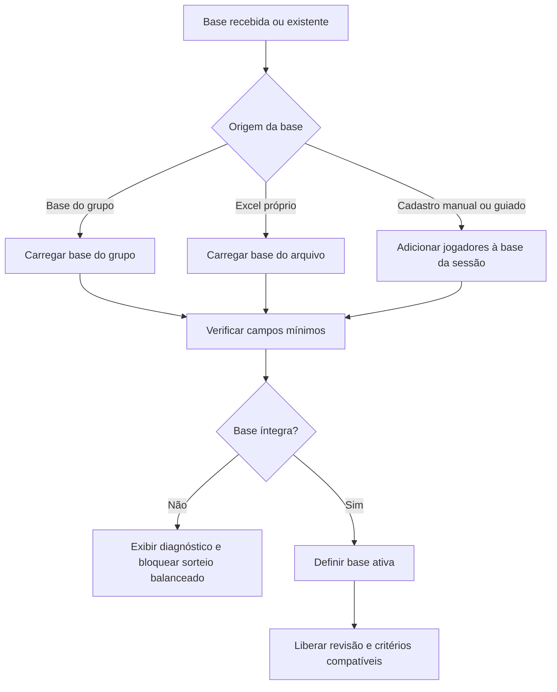

# Etapa 02 — Base de Jogadores

**Microetapa:** v137-docs-contratos-operacionais-etapas  
**Baseline documental de entrada:** v136  
**Commit base:** `6349d3eab92b7cb82d79e21843c109bdb16093b7`  
**Natureza:** contrato operacional por etapa, sem alteração funcional

Este documento define o contrato da base de jogadores usada pelo Sorteador Pelada PRO. Ele complementa o contrato mestre e não autoriza alteração funcional.

---

## 1. Finalidade

A base de jogadores fornece os atributos necessários para o sorteio balanceado e para a revisão de nomes informados na lista.

---

## 2. Fluxo visual da etapa



---

## 3. Entradas operacionais

A etapa pode receber:

- base do grupo;
- Excel próprio;
- jogadores adicionados manualmente;
- correções de inconsistências cadastrais;
- registros criados pelo cadastro guiado.

---

## 4. Campos contratuais mínimos

A base operacional deve conter, direta ou indiretamente:

| Campo | Uso |
|---|---|
| Nome | Identificação e correspondência com a lista. |
| Posição | Critério posicional e regra de goleiros. |
| Nota | Critério quantitativo de equilíbrio. |
| Velocidade | Critério quantitativo de equilíbrio. |
| Movimentação | Critério quantitativo de equilíbrio. |

---

## 5. Regras contratuais

1. A base deve preservar nomes suficientes para correspondência com a lista.
2. A posição `G` é válida quando o jogador atua como goleiro.
3. As posições `D`, `M` e `A` participam do equilíbrio posicional comum.
4. Goleiros possuem regra própria quando a quantidade é compatível com o número de times.
5. Registros duplicados ou inconsistentes devem ser diagnosticados antes do sorteio balanceado.
6. Jogadores adicionados manualmente devem compor a base corrente da sessão.
7. A etapa não deve sortear times.
8. A etapa não deve alterar critérios ativos por conta própria.

---

## 6. Saídas esperadas

A etapa pode produzir:

- base ativa;
- resumo visual da base;
- diagnóstico de integridade;
- lista de inconsistências;
- bloqueios ou avisos;
- base enriquecida com novos jogadores cadastrados.

---

## 7. Bloqueios

A etapa deve bloquear ou exigir correção quando houver:

- nomes duplicados impeditivos;
- campos obrigatórios ausentes;
- posições inválidas;
- valores quantitativos incompatíveis com o sorteio balanceado;
- ausência de base em fluxo que exige base.

---

## 8. Não regressão

Alterações futuras não devem:

- remover suporte à posição `G` no fluxo guiado;
- alterar regra de um goleiro por time quando aplicável;
- modificar o otimizador sem microetapa funcional própria;
- aceitar base inválida como se estivesse pronta;
- alterar arquivos protegidos sem manifesto.

---

## 9. Validação mínima recomendada

```bash
python -m pytest tests/test_state_smoke.py
python -m pytest tests/test_goleiros_smoke.py
python scripts/quality/protected_scope_hash_guard.py
python scripts/quality/release_artifacts_hygiene_guard.py
python scripts/quality/script_exit_codes_contract_guard.py
git status --short
```