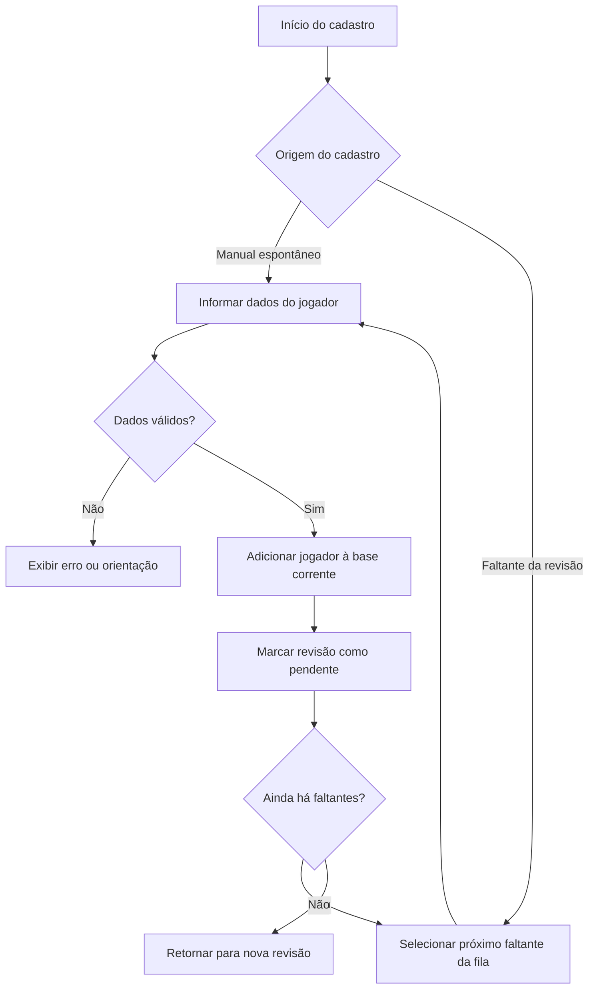

# Etapa 03 — Cadastro Manual e Guiado

**Microetapa:** v137-docs-contratos-operacionais-etapas  
**Baseline documental de entrada:** v136  
**Commit base:** `6349d3eab92b7cb82d79e21843c109bdb16093b7`  
**Natureza:** contrato operacional por etapa, sem alteração funcional

Este documento define o contrato operacional dos fluxos de cadastro de jogadores no Sorteador Pelada PRO.

---

## 1. Finalidade

O cadastro permite complementar a base corrente quando jogadores ausentes precisam ser incluídos antes do sorteio balanceado. O app possui dois usos principais:

1. cadastro manual espontâneo;
2. cadastro guiado a partir de faltantes identificados na revisão.

---

## 2. Fluxo visual da etapa



---

## 3. Entradas operacionais

As entradas são:

- nome do jogador;
- posição;
- nota;
- velocidade;
- movimentação;
- origem do cadastro, quando guiado;
- fila de faltantes, quando aplicável.

---

## 4. Estados envolvidos

| Estado | Papel operacional |
|---|---|
| `novos_jogadores` | Armazena jogadores adicionados na sessão. |
| `faltantes_revisao` | Mantém a fila de nomes ausentes. |
| `cadastro_guiado_ativo` | Indica se há cadastro guiado em andamento. |
| `faltantes_cadastrados_na_rodada` | Registra nomes cadastrados no ciclo corrente. |
| `revisao_pendente_pos_cadastro` | Obriga nova revisão após cadastro. |
| `lista_revisada_confirmada` | Deve ser invalidada quando o cadastro muda a base. |

---

## 5. Regras contratuais

1. O cadastro guiado nasce da revisão da lista, não do sorteio.
2. Enquanto houver cadastro guiado ativo, o sorteio balanceado não deve ser liberado.
3. Após cadastrar faltantes, uma nova revisão deve ocorrer antes da confirmação final.
4. O cadastro guiado deve preservar o nome vindo da lista, salvo correção explícita.
5. Se o faltante veio da seção `Goleiros:`, a posição `G` pode ser usada como padrão operacional.
6. O cadastro manual não deve alterar resultado já sorteado sem invalidação compatível.
7. O cadastro não deve executar otimização nem sortear times.
8. A inclusão de jogador deve afetar a assinatura de entrada do resultado.

---

## 6. Saídas esperadas

A etapa pode produzir:

- jogador incluído na base corrente;
- fila de faltantes atualizada;
- revisão marcada como pendente;
- mensagens de sucesso, orientação ou bloqueio;
- invalidação de resultado/revisão dependente da base anterior.

---

## 7. Bloqueios

A etapa deve bloquear avanço quando:

- nome obrigatório está ausente;
- posição inválida foi informada;
- nota, velocidade ou movimentação são inválidas;
- ainda há faltantes não cadastrados;
- a revisão pós-cadastro ainda não foi executada.

---

## 8. Não regressão

Alterações futuras não devem:

- liberar sorteio durante cadastro guiado ativo;
- perder a fila de múltiplos faltantes;
- regredir o comportamento de scroll da revisão/cadastro;
- remover suporte à posição `G` no cadastro guiado;
- alterar arquivos protegidos sem microetapa própria.

---

## 9. Validação mínima recomendada

```bash
python -m pytest tests/test_state_smoke.py
python -m pytest tests/test_goleiros_smoke.py
python scripts/quality/protected_scope_hash_guard.py
python scripts/quality/release_artifacts_hygiene_guard.py
python scripts/quality/script_exit_codes_contract_guard.py
git status --short
```