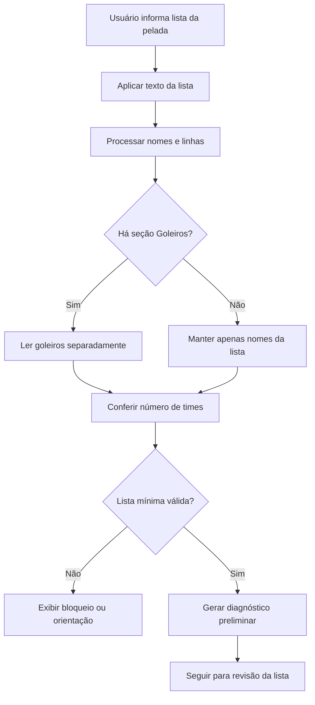

# Etapa 04 — Lista da Pelada

**Microetapa:** v137-docs-contratos-operacionais-etapas  
**Baseline documental de entrada:** v136  
**Commit base:** `6349d3eab92b7cb82d79e21843c109bdb16093b7`  
**Natureza:** contrato operacional por etapa, sem alteração funcional

Este documento define o contrato da entrada textual da lista da pelada.

---

## 1. Finalidade

A lista da pelada é a entrada nominal dos participantes que serão considerados para revisão e sorteio. Ela pode operar com ou sem base carregada.

---

## 2. Fluxo visual da etapa



---

## 3. Entradas operacionais

A etapa recebe:

- texto da lista;
- nomes numerados ou não numerados;
- seção opcional `Goleiros:`;
- número de times;
- parâmetros pré-revisão associados à lista.

---

## 4. Estados envolvidos

| Estado | Papel operacional |
|---|---|
| `lista_texto_input` | Texto efetivamente usado no fluxo. |
| `lista_texto_input__draft` | Rascunho visual da lista. |
| `lista_texto_input__pending` | Texto pendente de aplicação. |
| `lista_texto_revisado` | Lista revisada quando aplicável. |
| `qtd_times_sorteio` | Número de times informado. |
| `sortear_goleiros` | Parâmetro pré-revisão dependente da lista. |

---

## 5. Regras contratuais

1. A lista deve ser lida antes da revisão.
2. Nomes duplicados devem ser diagnosticados.
3. Linhas vazias ou não interpretáveis podem ser ignoradas com diagnóstico.
4. A seção `Goleiros:` deve ser lida separadamente quando presente.
5. A opção de incluir goleiros depende da compatibilidade entre goleiros detectados e número de times.
6. A alteração do texto da lista deve invalidar resultado dependente de assinatura anterior.
7. A alteração do número de times deve invalidar resultado dependente de assinatura anterior.
8. A lista não deve executar sorteio diretamente; ela apenas alimenta revisão e gate pré-sorteio.

---

## 6. Saídas esperadas

A etapa pode produzir:

- nomes lidos;
- nomes únicos;
- linhas ignoradas;
- duplicidades detectadas;
- goleiros detectados;
- diagnóstico preliminar;
- parâmetros de compatibilidade com número de times.

---

## 7. Bloqueios

A etapa deve bloquear avanço quando:

- lista está vazia;
- número de jogadores é insuficiente;
- número de times é incompatível com a quantidade de jogadores;
- há pendências que impedem revisão ou sorteio.

---

## 8. Não regressão

Alterações futuras não devem:

- perder nomes após salvar rascunho;
- alterar a interpretação da seção `Goleiros:` sem microetapa funcional própria;
- liberar sorteio com lista inconsistente;
- deixar resultado antigo ativo após mudança da lista ou do número de times.

---

## 9. Validação mínima recomendada

```bash
python -m pytest tests/test_ui_safe_smoke.py
python -m pytest tests/test_goleiros_smoke.py
python scripts/quality/protected_scope_hash_guard.py
python scripts/quality/release_artifacts_hygiene_guard.py
python scripts/quality/script_exit_codes_contract_guard.py
git status --short
```