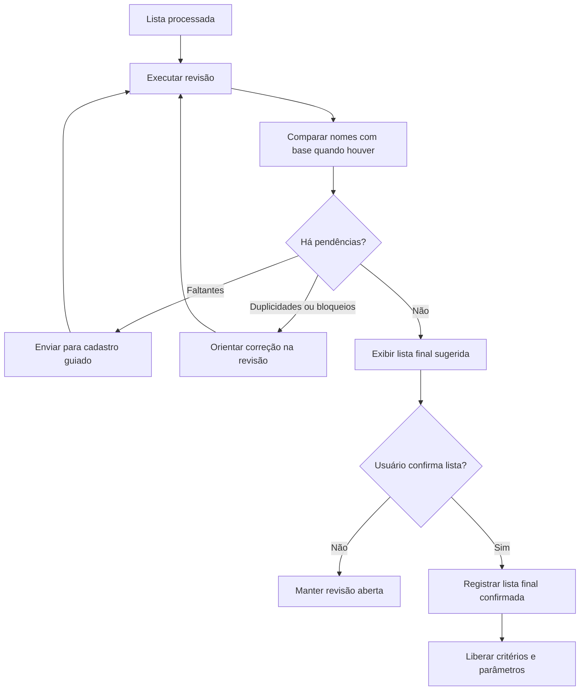

# Etapa 05 — Revisão da Lista

**Microetapa:** v137-docs-contratos-operacionais-etapas  
**Baseline documental de entrada:** v136  
**Commit base:** `6349d3eab92b7cb82d79e21843c109bdb16093b7`  
**Natureza:** contrato operacional por etapa, sem alteração funcional

Este documento define o contrato da revisão da lista antes do sorteio.

---

## 1. Finalidade

A revisão transforma a lista textual em uma lista operacional validada, corrigida quando possível e pronta para confirmação final.

---

## 2. Fluxo visual da etapa



---

## 3. Entradas operacionais

A etapa recebe:

- nomes lidos da lista;
- nomes únicos;
- base ativa, quando existente;
- goleiros lidos, quando aplicável;
- correções automáticas sugeridas;
- dados de cadastro guiado já incorporados.

---

## 4. Estados envolvidos

| Estado | Papel operacional |
|---|---|
| `diagnostico_lista` | Guarda o diagnóstico da lista. |
| `lista_revisada` | Guarda a lista operacional revisada. |
| `lista_revisada_confirmada` | Indica confirmação final. |
| `revisao_lista_expandida` | Controla estado visual da revisão. |
| `scroll_para_revisao` | Controla retorno visual à revisão. |
| `scroll_destino_revisao` | Define destino de scroll após ações. |
| `scroll_alvo_id_revisao` | Identifica alvo visual específico da revisão. |

---

## 5. Regras contratuais

1. A revisão é obrigatória para sorteio balanceado.
2. Nomes não encontrados na base devem gerar pendência de cadastro guiado ou correção.
3. Duplicidades devem ser apresentadas antes da confirmação.
4. Correções automáticas devem ser visíveis ou rastreáveis no diagnóstico.
5. A confirmação final só pode ocorrer sem pendências bloqueantes.
6. Cadastro guiado posterior deve invalidar confirmação anterior.
7. Mudança em `sortear_goleiros` deve exigir nova revisão quando altera a composição operacional.
8. A revisão não deve executar o sorteio.

---

## 6. Saídas esperadas

A etapa pode produzir:

- lista revisada sugerida;
- nomes corrigidos;
- nomes faltantes;
- duplicidades;
- bloqueios;
- avisos;
- confirmação da lista final;
- orientação para cadastro guiado.

---

## 7. Bloqueios

A etapa deve bloquear confirmação ou sorteio quando:

- há faltantes não resolvidos;
- há duplicidade impeditiva;
- há inconsistência de base relevante;
- cadastro guiado está ativo;
- revisão pós-cadastro ainda não foi feita.

---

## 8. Não regressão

Alterações futuras não devem:

- regredir o fluxo de múltiplos faltantes;
- regredir o scrollfix da revisão/cadastro;
- permitir confirmação com pendência bloqueante;
- alterar arquivos protegidos sem manifesto;
- ocultar inconsistências relevantes da base.

---

## 9. Validação mínima recomendada

```bash
python -m pytest tests/test_ui_safe_smoke.py
python -m pytest tests/test_state_smoke.py
python -m pytest tests/test_goleiros_smoke.py
python scripts/quality/protected_scope_hash_guard.py
python scripts/quality/release_artifacts_hygiene_guard.py
python scripts/quality/script_exit_codes_contract_guard.py
git status --short
```