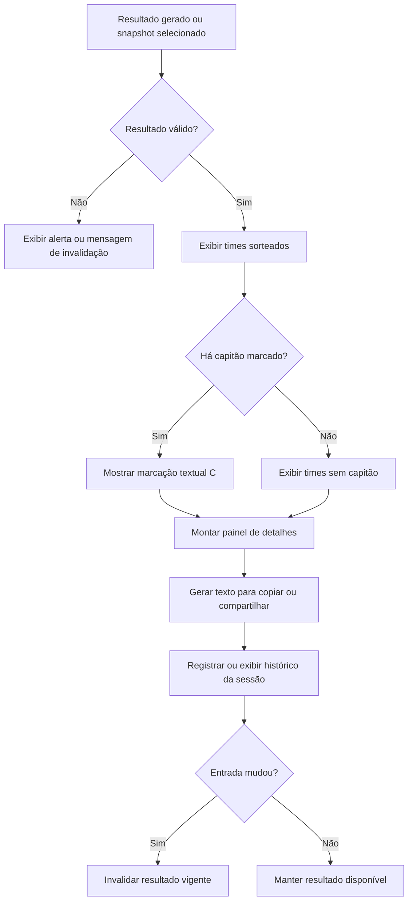

# Etapa 08 — Resultado, Compartilhamento e Histórico

**Microetapa:** v137-docs-contratos-operacionais-etapas  
**Baseline documental de entrada:** v136  
**Commit base:** `6349d3eab92b7cb82d79e21843c109bdb16093b7`  
**Natureza:** contrato operacional por etapa, sem alteração funcional

Este documento define o contrato da apresentação do resultado, geração de texto para compartilhamento e histórico curto da sessão.

---

## 1. Finalidade

A etapa apresenta os times sorteados, permite copiar ou compartilhar o resultado e mantém snapshots recentes da sessão.

---

## 2. Fluxo visual da etapa



---

## 3. Entradas operacionais

A etapa recebe:

- resultado sorteado;
- contexto do resultado;
- odds, quando aplicáveis;
- status de critérios;
- status de goleiros;
- status de capitão;
- snapshots já armazenados.

---

## 4. Estados envolvidos

| Estado | Papel operacional |
|---|---|
| `resultado` | Times vigentes exibidos. |
| `resultado_contexto` | Metadados do sorteio. |
| `resultado_assinatura` | Assinatura de validade. |
| `resultados_sessao_historico` | Histórico curto da sessão. |
| `resultado_historico_ativo_id` | Snapshot histórico selecionado. |
| `resultado_historico_ultimo_snapshot_id` | Último snapshot criado. |
| `scroll_para_resultado` | Controle de navegação visual até o resultado. |

---

## 5. Regras contratuais

1. O resultado exibido deve corresponder à assinatura de entrada vigente ou a snapshot histórico explicitamente selecionado.
2. Quando `sortear_capitao` está ativo, cada time não vazio deve exibir um jogador com marcação `(C)`.
3. O texto de cópia e compartilhamento deve preservar a marcação `(C)`.
4. O painel de detalhes deve exibir status de critérios, goleiros e capitão de forma coerente com o resultado apresentado.
5. O histórico deve preservar snapshots da sessão sem reexecutar sorteio.
6. Alteração de entrada deve invalidar resultado vigente quando a assinatura divergir.
7. Snapshot histórico não deve ser confundido com resultado vigente para decisões futuras.
8. A etapa não deve alterar regras de sorteio nem otimização.

---

## 6. Saídas esperadas

A etapa pode produzir:

- cards ou blocos visuais dos times;
- odds, quando aplicáveis;
- painel de detalhes;
- texto para copiar;
- texto para compartilhar;
- snapshots de histórico;
- mensagens de invalidação de resultado.

---

## 7. Bloqueios e alertas

A etapa deve alertar ou bloquear quando:

- não há resultado válido para exibir;
- resultado foi invalidado por mudança de entrada;
- snapshot histórico difere do contexto vigente;
- status de capitão, goleiros ou critérios não pode ser inferido com segurança.

---

## 8. Não regressão

Alterações futuras não devem:

- remover a marcação `(C)` do capitão no compartilhamento;
- exibir capitão ativo quando o snapshot não possui capitão;
- confundir snapshot histórico com resultado vigente;
- alterar regras do sorteio a partir da camada visual;
- alterar arquivos protegidos sem microetapa própria.

---

## 9. Observação sobre risco residual

A v136 registrou risco residual pós-v135 relacionado à inferência do status do capitão ao visualizar snapshot histórico. Este contrato preserva a exigência de coerência entre o status exibido e o resultado apresentado, mas não corrige código funcional.

---

## 10. Validação mínima recomendada

```bash
python -m pytest tests/test_ui_safe_smoke.py
python -m pytest tests/test_state_smoke.py
python -m pytest tests/test_goleiros_smoke.py
python scripts/quality/protected_scope_hash_guard.py
python scripts/quality/release_artifacts_hygiene_guard.py
python scripts/quality/script_exit_codes_contract_guard.py
git status --short
```